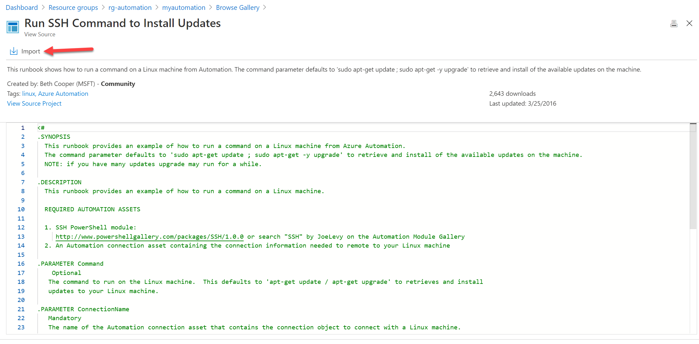
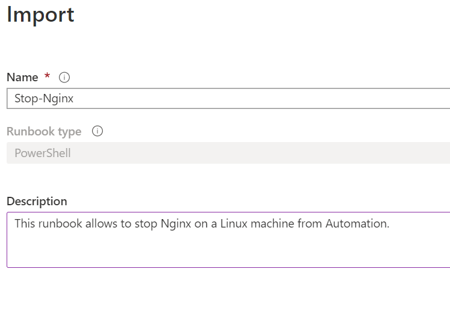

# How to use the Azure Automation to run scripts inside a Linux Virtual Machine

The purpose of this document is to provide instructions on how to use the Azure Automation to execute scripts inside Linux Virtual Machines. In this lab scenario, the Linux VM will be runing on Azure and the connection from the Azure Automation to the VM will be done through the public IP of the VM.

## Automation Account

First of all, you need to have an Automation Account. In order to have this, follow those steps:

1. [Create a resource group](https://docs.microsoft.com/en-us/azure/azure-resource-manager/management/manage-resource-groups-portal#create-resource-groups) called **rg-automation**;
2. [Create an automation account](https://docs.microsoft.com/en-us/azure/automation/automation-quickstart-create-account) on the resource group previously created;

## Runbook

Now you have your automation account created, go to **Process Automation** > **Runbooks** > **Browse gallery** and lets import a Runbook:

Then search by **Run SSH**:

Click to import:

Now let's start with some changes. I'll change the name in order to be more acurated with the function desired. I'lll rename the name to **Stop-Nginx** and create an appropriated description:

Finishing the importing:

